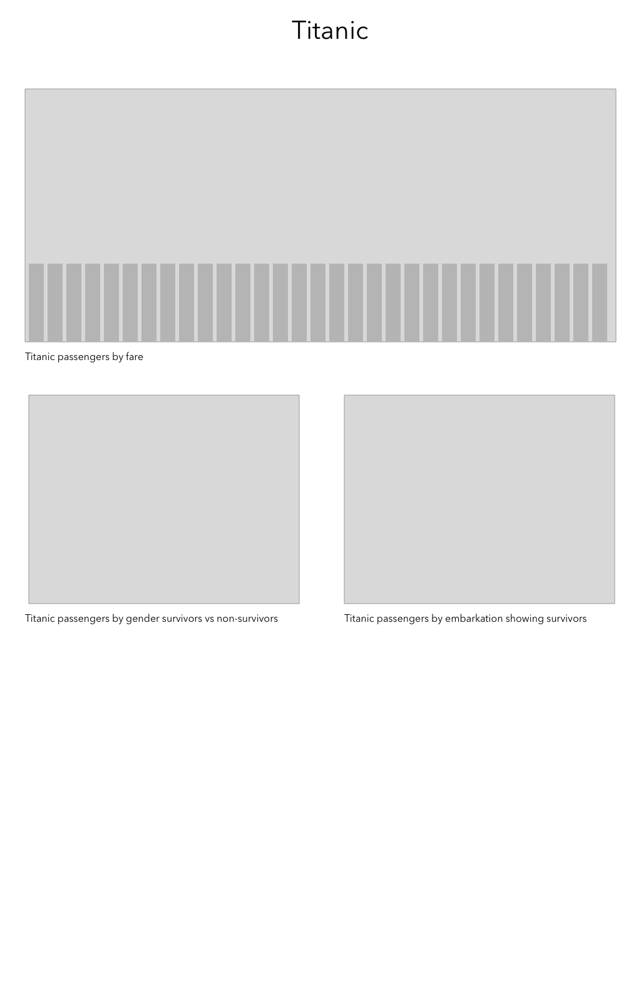

# FEW 2.5 Visualization 2

## Visualizing data with HTML, CSS, and JS

**Due Date:** Wed, January 29

Your goal is to create a web page with **3 visualizations** built with HTML, CSS, and Javascript from the Titanic dataset.

For this assignment, the goal is to make the most interesting visualizations that you can. 

Each visualization should inlcude a caption with a description of what is displayed. For example: All passengers who survived by gender, or: All passengers and fares paid. 

Use size shape and color to show points of data. For example survived/died could be shown by color, fare paid could shown by width or height. 

You should be writing your own code. Don't import any libraries. We will be talking about using libraries in class later. For this assignment the goal is get an idea of the code that is needed to turn numbers into pictures.

What to display? This is up to you try these challenges. Create one or more graphs. Each graph can display one or more of the challenges below. 

1. Display all passengers
2. Show passengers survived
3. Show the gender of each passenger
4. Show the age of each passenger
5. Show the fare paid by each passenger
6. Show the embarkation of each passenger
7. Show the number of siblings for each passenger

You should have three visualizations.

## Getting started

Follow these two tutorials:

- [Working with Data](https://github.com/MakeSchool-Tutorials/FEW-2-5-Data-Visualization-Working-with-Data)
- [Visualizations with HTML, CSS, and JS](https://github.com/MakeSchool-Tutorials/FEW-2-5-Data-Visualization-with-HTML-CSS-JS-Tutorial)

## Deliverables

Your deliverables for this assignment is a single web page that displays three data visualization built with HTML, CSS, and JS. Your page should be hosted on GitHub Pages. 

Post a link to the progress tracker.

## Due Date

**Due Date:** Wed, January 29

### Evaluate your work

The deliverable is a single web page that displays data graphically.

Include all of your code in a GitHub Repo.

Create a GitHub Page that displays your work live.

The goal is to turn numbers into shapes and colors.

| Aspect | Does not meet | Meets | Exceeds |
|:------------|:-------------|:------|:--------|
| **Aesthetics** | Uses few styles, or three, and is not interesting visually | Uses a range of styles, more than 3, is interesting to look at | People are impressed and intrigued by your work |
| **Depth** | Displays 2 values from the dataset | Displays 3 or 4 data points | Displays 5 or more data points |
| **Code quality** | Does not follow coding best practice, the style inconsistent | Code is consistently styled and follows coding best practice, you used a linter | Code reviewed by peer |
| **Completion** | Seems incomplete, missing features from the description, is not on GitHub pages | Is on Github pages, has all feature from the homework description | Includes new features and expands on the homework description |

### Learing Objectives 

| Aspect | Does not meet | Meets | Exceeds |
|:-------|:--------------|:------|:--------|
| **Create Elements with JS** | Can not create DOM elements with JS (without a reference) | Can create DOM elements without a reference | Can create any element of any type and attach it anywhere in the DOM |
| **Data Visualization** | Can not display data a dataset in the DOM | Can display data visually in the DOM | Can display data visually in a wide variety of ways |
| **Apply CSS Styles with JS** | Can't apply CSS style with JS without a reference | Can apply CSS styles with JS | Can apply a wide variety of styles to any element in the DOM |
| **Normalizing data** | Can't normalize data and or describe the purpose of normalization | Can normalize data and describe the use of normalization | Can normalize data from any values into disparate ranges for things like color |