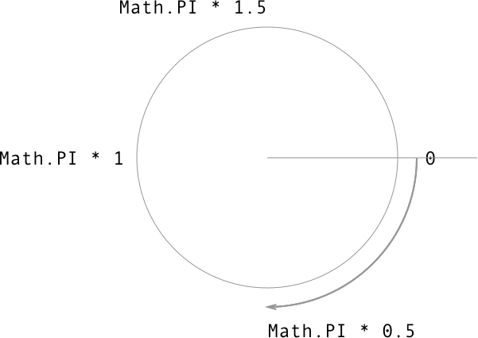
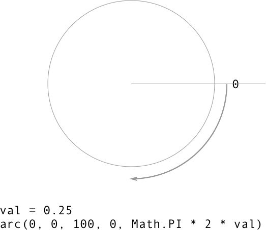
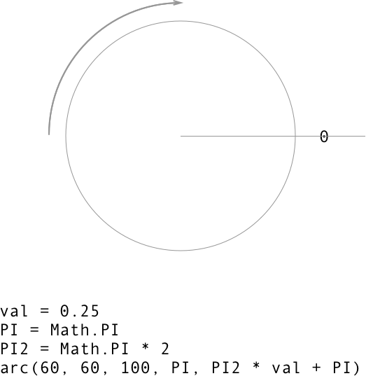

<!-- .slide: data-background="./Images/header.svg" data-background-repeat="none" data-background-size="40% 40%" data-background-position="center 10%" class="header" -->
# FEW 2.5 - Working with Canvas

<!-- Put a link to the slides so that students can find them -->

➡️ [**Slides**](/FEW-2.5-Data-Visualization-and-Web-Graphics/Slides/Lesson-5.html ':ignore')

<!-- > -->

## Minute-by-Minute

| **Elapsed** | **Time**  | **Activity**              |
| ----------- | --------- | ------------------------- |
| 0:00        | 0:05      | Overview + Learning Outcomes                |
| 0:05        | 0:25      | GitHub Pages                  |
| 0:30        | 0:40      | Canvas       |
| 1:10        | 0:10      | Blocks                     |
| 1:20        | 0:10      | Sets      |
| 1:30        | 0:10      | BREAK      |
| 1:40        | 1:00      | Lab      |
| 2:40        | 0:05      | Wrap up + Homework Overview |
| TOTAL       | 2:45      | -                         |


<!-- > -->

## Overview

This session will work with canvas. HTML offers some interesting possibilities but also has some limitations. Canvas gives you the power to draw with pixels directly to the screen.

<!-- > -->

## Why you should know this

Canvas is the only way to draw something. Anytime you are working with images and image generation canvas will be behind it all.

<!-- > -->

## Learning Objectives

- Use canvas to create images
    - Use data to draw a rectangle of any size and any position
    - Use data to draw circles anywhere on the screen
    - Use data to draw arcs anywhere with any radius
- Use trigonometry concepts to describe circles and arcs
- Using GitHub Pages

<!-- > -->

## Your work on GitHub Pages

Use GitHub Pages to host your work. Each of your visualizations should exist on GitHub Pages.

Take some time to do the following:

1. Follow the guide [here](https://pages.github.com) to setup your GitHub Pages.
1. Add a link to your GitHub Pages repo in the project tracker.

For inspiration, here are some [example visualizations](https://github.com/soggybag/data-visualizations) on GitHub Pages.

<!-- > -->

## Canvas Intro

What is Canvas? **Canvas** is a rectangular area filled with pixels. The canvas object has methods that allow you to access the pixel data and draw images.

See the sample code for these concepts here: [lesson-05.html](../lesson-05.html).

<!-- v -->

### Drawing things with canvas

**Context** - All of the drawing methods are accessed through the context. The context is a single shared object that acts like a toolbox.

**Coords** - Canvas is mapped out in a grid that starts from the upper left corner. Grid coordinates are measured in pixels.

The horizontal axis is **x**

The vertical axis is **y**

Usually, functions will ask for an x and y value to position something.

**Paths** - Using the drawing tools you will often be creating paths. Paths are not visible until you stroke and or fill them with pixels.

Usually you will begin a new path, draw a path, stroke and fill the path, then close the path. In code that might look like:

```JS
ctx.beginPath()    // Start a new path
ctx.moveTo(50, 350) // move to a starting point
ctx.lineTo(550, 50) // draw a line to this point
ctx.lineWidth = 13 // set the width of a stroke
ctx.strokeStyle = 'red' // set the color of the stroke
ctx.stroke() // draw the stroke
```

**Rectangles** - You can draw rectangles with `moveTo()` and `lineTo()` the `rect()` function is a short cut.

```JS
ctx.beginPath()    // Begin a path
ctx.rect(200, 120, 100, 140) // draw a rectangle
ctx.fillStyle = 'red' // set the fill style
ctx.fill() // fill the rectangle
```

**Strokes and Fills** - When you want to see a path on the screen you'll need to stroke or fill it. To do this set the `fillStyle`, and or `strokeStyle` to the color, and the `lineWidth`, then call `fill()` or `stroke()`

**Arcs and Circles** - Use the `arc()` method to draw arcs and circles.

`arc(centerX, centerY, radius, startingAngle, endingAngle)`

The signature describes how the method draws. The first two parameters are like planting the point of a compass at a location. Then you need to set the radius and starting and ending angle.

Note that the angle is in radians!

<!-- v -->

## Quick note about radians

Circles are measured in **radians**. A complete circle is 2 * PI. Half a circle would be PI.



If you want to draw an arc that represents a value follow this guide:

- Normalize your value (convert it to a range of 0 - 1 by dividing by the largest value in the set)
- Decide on the range of the arc.
    - If you want 100% to be a full circle multiply by `Math.PI * 2`
    - If you want 100% to be a half circle multiply by `Math.PI`
- Decide on the starting angle. The default will start drawing from 0 in the diagram above and follow the arrow. Find the starting position in the diagram and add that value to both the starting angle and ending angle.





<!-- > -->

## Blocks

A block is a block of code. Often you define these as part of a function, if statements, and loops. The block is defined with `{}`.

```JS
function() { ...block... }

if () { ...block... }

for () { ...block... }
```

You can also define standalone blocks that are not part of `statement`.

```JS
{ ...block... }
```

Why? Scope! Variables defined with `const` or `let` are block scoped!

```JS
{
    let i = 0
    const step = 600 / 12
    ...
}

console.log(i) // undefined
```

In the example above `i` and `step` would only be available inside the `{ block }`

<!-- > -->

## Sets

A **set** is like an array but may only contain unique values. Sets are more efficient than arrays and may add a slight performance boost in some cases.

```JS
// Create a new set
const mySet = new Set() // or new Set([1,2,3])
// Add elements
mySet.add(1)
mySet.add(2)
mySet.add(3)
mySet.add(1)
console.log(mySet) // Set(3) [1, 2, 3]
// Count the set -> mySet.length 0
console.log(mySet.size) // 3
// Iterate over the set
mySet.forEach((val, key) => {
    console.log(val) // 1, 2, 3
})
// Check if an value exists
console.log(mySet.has(1)) // true
console.log(mySet.has(5)) // false
// Remove an element from the set
mySet.delete(2) // returns true
console.log(mySet.has(2))    // false
```

The examples in the code sample for this class uses Set.

<!-- > -->

<!-- .slide: data-background="#087CB8" -->
## [**10m**] BREAK

<!-- > -->

## Lab

You might remember these interview questions from a previous lesson. We're going to answer those same questions on the Titanic dataset, but this time using Canvas!

**Attempt at least 4 of the questions below. Stretch challenge to get more**

- Easy
	- Generate one element for each record in the Titanic Dataset
	- Create one element for each male passenger
	- Create one element for each female passenger
- Moderate
	- Create two elements that show the ratio of passengers who survived vs those that didn't. (easy solution make a bar graph)
	- Create elements showing the ratio of passengers by `pclass` (easy solution make a bar graph)
- Hard
	- Show the ratio of men and women who survived vs men and women who did not survive.
	- Show the ratio of passengers who survived vs those that did not by embarkation.

<!-- > -->

## After Class

- Continue working on [Visualization 2](Assignments/Data-Visualization-2.md), due 2/12 11:59pm

<!-- > -->

## Resources

- [Set](https://developer.mozilla.org/en-US/docs/Web/JavaScript/Reference/Global_Objects/Set/prototype)
    - [Set.size](https://developer.mozilla.org/en-US/docs/Web/JavaScript/Reference/Global_Objects/Set/size)
    - [Set.add()](https://developer.mozilla.org/en-US/docs/Web/JavaScript/Reference/Global_Objects/Set/add)
    - [Set.delete()](https://developer.mozilla.org/en-US/docs/Web/JavaScript/Reference/Global_Objects/Set/delete)
    - [Set.has()](https://developer.mozilla.org/en-US/docs/Web/JavaScript/Reference/Global_Objects/Set/has)
- [Canvas](https://developer.mozilla.org/en-US/docs/Glossary/Canvas)
    - [ctx.arc()](https://developer.mozilla.org/en-US/docs/Web/API/CanvasRenderingContext2D/arc)
    - [ctx.lineWidth](https://developer.mozilla.org/en-US/docs/Web/API/CanvasRenderingContext2D/lineWidth)
    - [ctx.fillStyle](https://developer.mozilla.org/en-US/docs/Web/API/CanvasRenderingContext2D/fillStyle)
    - [ctx.strokeStyle](https://developer.mozilla.org/en-US/docs/Web/API/CanvasRenderingContext2D/strokeStyle)
    - [arc.lineTo()](https://developer.mozilla.org/en-US/docs/Web/API/CanvasRenderingContext2D/lineTo)
    - [ctx.moveTo()](https://developer.mozilla.org/en-US/docs/Web/API/CanvasRenderingContext2D/moveTo)
    - [ctx.rec()](https://developer.mozilla.org/en-US/docs/Web/API/CanvasRenderingContext2D/rect)
